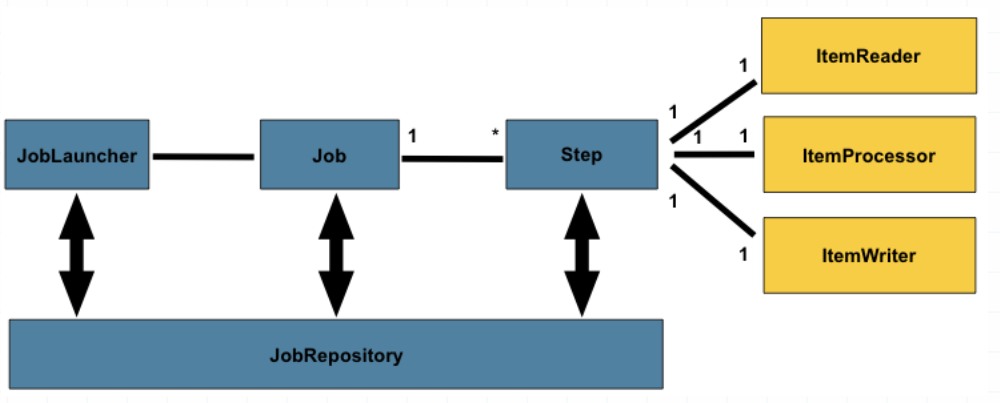

# Spring Boot Batch

## 배치 어플리케이션의 특징 
- 단발성으로 대용량의 데이터를 처리하는 어플리케이션
- 실시간 처리가 어려운 대용량 데이터나 대규모 데이터일 경우에 배치 어플리케이션을 사용
- 데이터를 읽고(read) 가공한 후(process) 수정된 데이터를 다시 저장소에 저장(write)


## Spring Batch
- Accenture와 Pivotal의 공동 작업으로 2007년에 탄생
  - Accenture의 배치 노하우 & 기술력과 Spring 프레임워크의 결합
- 비즈니스 로직에 집중 가능


## Spring Boot Batch
- Spring Batch의 환경설정을 최소화하고 쉽게 사용할 수 있도록 래핑한 프로젝트

### pom.xml 의존성 설정
  ```
        <dependency>
            <groupId>org.springframework.boot</groupId>
            <artifactId>spring-boot-starter-batch</artifactId>
        </dependency>
        <dependency>
            <groupId>org.springframework.boot</groupId>
            <artifactId>spring-boot-starter-test</artifactId>
            <scope>test</scope>
        </dependency>
  ```    

### @EnableBatchProcessing

  - 스프링 부트 배치 스타터에 미리 정의된 설정들을 실행(JobBuilder, StepBuilder 등의 설정이 자동 주입)
  ```
      @SpringBootApplication
      @EnableBatchProcessing
      public class BatchApplication {
      	public static void main(String[] args) {
      		SpringApplication.run(BatchApplication.class, args);
      	}
      }
  ```

## 시나리오 
 - mysql 테이블에 있는 object key 중에 lastModified 가 최근 N달(month) 이내인 object key 를 추출하는 시나리오
 - ```
    CREATE TABLE object_key_info (
      object_key varchar(100) NOT NULL,
      last_modified timestamp NOT NULL,
      PRIMARY KEY (object_key)
    );
   ```
## 배치 컴포넌트 관계도


   
   
### JobLauncher 

 > Job을 실행시키는 역할을 하는 인터페이스

### JobRepository
 > 배치 처리에 대한 메타데이터 저장/관리
  - Job 실행에 대한 정보(JobExecution)    
  - Step 실행에 대한 정보(StepExecution)
  
### Job
  > 전체 배치 처리에 있어 최상단 계층에 있는 객체, 여러 step들을 명시
  
  - job 선언 예제  

  - ```
    @Configuration
    @RequiredArgsConstructor
    @ComponentScan("batch")
    @Slf4j
    public class InactiveUserJobConfig {
        private final static int CHUNK_SIZE = 5;
    
        private final ObjectKeyRepository objectKeyRepository;
    
        private final JobBuilderFactory jobBuilderFactory;
    
        private final StepBuilderFactory stepBuilderFactory;
    
        @Bean
        public Job inactiveUserJob() {
            return jobBuilderFactory.get("inactiveUserJob")
                    .start(inactiveJobStep())
                    .build();
        }
    ```

### Step
 > 실제 Batch 작업을 수행하는 역할 
 >  reader, processor, writer로 이루어짐

   - step 선언 예제
   
     ```
        public class InactiveUserJobConfig {
            private final static int CHUNK_SIZE = 5;
        
            private final UserRepository userRepository;
        
            private final JobBuilderFactory jobBuilderFactory;
        
            private final StepBuilderFactory stepBuilderFactory;
        
        
            @Bean
            public Step inactiveJobStep() {
                return stepBuilderFactory.get("inactiveUserStep")
                        .<User, User> chunk(CHUNK_SIZE)
                        .reader(inactiveUserReader())
                        .processor(inactiveUserProcessor())
                        .writer(inactiveUserWriter())
                        .build();
            }
        ```
        
  - CHUNK_SIZE : Writer 가 처리하는 트랜잭션 단위(commit interval)
    - Chunk 단위로 트랜잭션을 수행하기 때문에 실패할 경우엔 해당 Chunk 만큼만 롤백이 되고, 이전에 커밋된 트랜잭션 범위까지는 반영

### Reader, Processor, Writer 

#### Reader
  - DB나 File로부터 데이터를 읽어들이는 역할
  - ItemReader 인터페이스의 구현체
    - JdbcCursorItemReader
    - JdbcPagingItemReader
    - JpaPagingItemReader
    - FlatFileItemReader
    - ListItemReader
     
     
- ```
    @Bean
    public JpaPagingItemReader<ObjectKeyInfo> jpaPagingItemReader() {
        return new JpaPagingItemReaderBuilder<ObjectKeyInfo>()
                .name("jpaPagingItemReader")
                .entityManagerFactory(entityManagerFactory)
                .pageSize(CHUNK_SIZE)
                .queryString("select o from ObjectKeyInfo o")
                .build();
    }
  ```


#### Processor

  - reader로부터 읽은 데이터를 가공하거나 필터링하는 역할
  - ItemProcessor 인터페이스의 구현체
  - 생략 가능(필수 X)
  
- ```  
  @Component
  public class ObjectKeyFilterProcessor implements ItemProcessor<ObjectKeyInfo, ObjectKeyInfo> {
  
      @Override
      public ObjectKeyInfo process(ObjectKeyInfo objectKeyInfo) {
  
          if (objectKeyInfo.getLastModified().isBefore(LocalDateTime.now().minusYears(1L))) {
              return null;
          }
          return objectKeyInfo;
      }
  }
  ```
  
#### Writer

 - reader로부터 읽은 데이터의 출력 기능(DB, File, Console)
 - Chunk 단위로 데이터 write
 - ItemWriter 인터페이스의 구현체
   - JdbcBatchItemWriter
   - JpaItemWriter
   - FlatFileItemWriter
   - Custom ItemWriter
 
- ```  
      @Bean
      public FlatFileItemWriter<ObjectKeyInfo> fileWriter() {
          FlatFileItemWriter<ObjectKeyInfo> writer = new FlatFileItemWriter<>();
  
          writer.setResource(outputResource);
          //writer.setAppendAllowed(true);
          writer.setLineAggregator(new DelimitedLineAggregator<ObjectKeyInfo>() {
              {
                  setDelimiter(",");
                  setFieldExtractor(new BeanWrapperFieldExtractor<ObjectKeyInfo>() {
                      {
                          setNames(new String[] {"objectKey", "lastModified"});
                      }
                  });
              }
          });
          return writer;
      }
  ```
  
  
### JobParameter

 - Job이 실행될 때 필요한 파라미터. Map 타입으로 저장
 - 사용 가능한 타입 : Double, Long, Date, String
 - @StepScope 또는 @JobScope로 Bean을 생성해야 함

```  
  @StepScope
  @Component
  public class ObjectKeyFilterProcessor implements ItemProcessor<ObjectKeyInfo, ObjectKeyInfo> {
  
      @Value("#{jobParameters['month']}")
      private Long month;
  
      @Override
      public ObjectKeyInfo process(ObjectKeyInfo objectKeyInfo) {
  
          if (objectKeyInfo.getLastModified().isBefore(LocalDateTime.now().minusMonths(month))) {
              return null;
          }
          return objectKeyInfo;
      }
  }
```  

  - job parameter 전달 방법  
  ```
     java -jar batch-application.jar month=4;      
  ```  
### Listener

 - 배치 흐름에서 전후 처리를 하는 역할
 - |인터페이스명|어노테이션|설명|
   |:---------:|:-------:|:---:|
   |JobExecutionListener|@BeforeJob @AfterJob|Job 실행 전후처리를 담당하는 Listener|
   |StepExecutionListener|@BeforeStep @AfterStep|Step 실행 전후 처리를 담당하는 Listener|
   |ChunkListener|@BeforeChunk @AfterChunk @AfterChunkError|Chunk 실행 전후 및 에러 발생 시 처리를 담당하는 Listener|
 

### step 흐름 제어

 - step 의 연속적 실행
 
 ```   
     @Bean
     public Job selectObjectKeyJobJob() {
         return jobBuilderFactory.get("selectObjectKeyJobJob")
                 .incrementer(new RunIdIncrementer())
                 .start(selectObjectKeyJobStep())
                 .next(step2())
                 .next(step3())
                 .build();
     }
 ```  

 - step의 조건별 흐름 제어
 ```
         @Bean
         public Job selectObjectKeyJob() {
             return jobBuilderFactory.get("selectObjectKeyJob")
                     .incrementer(new RunIdIncrementer())
                     .start(selectObjectKeyStep())
                     .on("FAILED")                 // FAILED 일 경우
                     .to(step3())                  // step3으로 이동한다.
                     .on("*")                      // step3의 결과 관계 없이
                     .end()                        // step3으로 이동하면 Flow가 종료한다.
                     .from(selectObjectKeyStep())  // selectObjectKeyStep로부터
                     .on("*")                      // FAILED 외에 모든 경우
                     .to(step2())                  // step2로 이동한다.
                     .on("*")                      // step2의 결과 관계 없이
                     .end()                        // step2으로 이동하면 Flow가 종료한다.
                     .end()                        // Job 종료
                     .build();
         }
 ```


### 테스트코드로 job 실행시키기 

 - 스프링 배치 테스트 유틸 클래스 : JobLauncherTestUtils 를 bean으로 설정

```
 @Configuration
 public class TestJobConfig {
 
     @Bean
     public JobLauncherTestUtils jobLauncherTestUtils() {
         return new JobLauncherTestUtils();
     }
 }
```

 ```
 @RunWith(SpringRunner.class)
 @SpringBootTest(classes = {SelectObjectKeyJobConfig.class})
 public class SelectObjectKeyJobTest {
 
     @Autowired
     private JobLauncherTestUtils jobLauncherTestUtils;
 
     @Test
     public void 오브젝트키_추출_잡_테스트() throws Exception {
 
         JobExecution jobExecution = jobLauncherTestUtils.launchJob(
                 new JobParametersBuilder(jobLauncherTestUtils.getUniqueJobParameters())
                         .addLong("month", 4L).toJobParameters()
 
         );
 
 		assertEquals(BatchStatus.COMPLETED, jobExecution.getStatus());
     }
 }
 ```
  
## 참고 자료

 - https://github.com/jojoldu/spring-batch-in-action
 - [처음 배우는 스프링부트2](https://www.hanbit.co.kr/store/books/look.php?p_code=B4458049183)

 